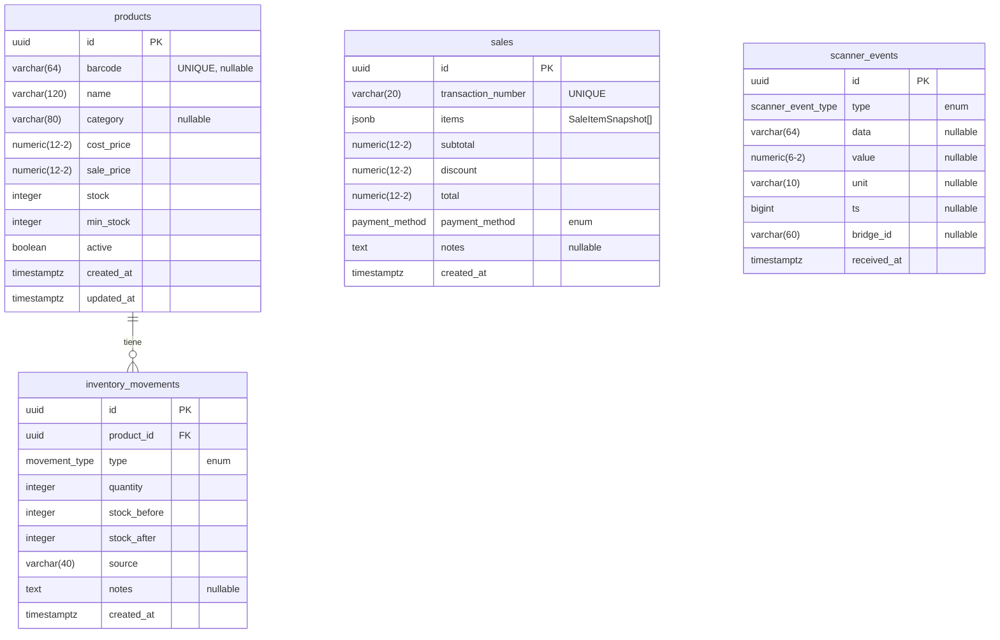

# ERD — Diagrama Entidad-Relación
## Sistema IoT Colina Real
## Impresiones Colina Real

**Versión**: 1.0
**Fecha**: 2026-05-28
**Autor**: Daniel Suárez

---

## Diagrama (Mermaid)



---

## Diagrama ASCII (Alternativo)

```
┌─────────────────────────────────┐         ┌──────────────────────────────────────┐
│            products             │         │         inventory_movements           │
├─────────────────────────────────┤         ├──────────────────────────────────────┤
│ id             UUID  PK         │ 1     N │ id             UUID  PK              │
│ barcode        VARCHAR(64) UQ   ├─────────► product_id     UUID  FK → products   │
│ name           VARCHAR(120)     │         │ type           movement_type (enum)  │
│ category       VARCHAR(80)      │         │ quantity       INTEGER               │
│ cost_price     NUMERIC(12,2)    │         │ stock_before   INTEGER               │
│ sale_price     NUMERIC(12,2)    │         │ stock_after    INTEGER               │
│ stock          INTEGER          │         │ source         VARCHAR(40)           │
│ min_stock      INTEGER          │         │ notes          TEXT                  │
│ active         BOOLEAN          │         │ created_at     TIMESTAMPTZ           │
│ created_at     TIMESTAMPTZ      │         └──────────────────────────────────────┘
│ updated_at     TIMESTAMPTZ      │
└─────────────────────────────────┘

┌─────────────────────────────────────────────────────────────────────────┐
│                                 sales                                   │
├─────────────────────────────────────────────────────────────────────────┤
│ id                 UUID         PK                                       │
│ transaction_number VARCHAR(20)  UNIQUE (formato: TXN-YYYYMMDD-NNNNN)   │
│ items              JSONB        [ SaleItemSnapshot, ... ]               │
│ subtotal           NUMERIC(12,2)                                        │
│ discount           NUMERIC(12,2) DEFAULT 0                              │
│ total              NUMERIC(12,2)                                        │
│ payment_method     payment_method (enum: cash|card|transfer|nequi)     │
│ notes              TEXT         nullable                                 │
│ created_at         TIMESTAMPTZ                                          │
└─────────────────────────────────────────────────────────────────────────┘

    Estructura del JSONB items (SaleItemSnapshot[]):
    ┌──────────────────────────────────────────────────────┐
    │  {                                                   │
    │    "productId":   "uuid | null",  ← null = servicio  │
    │    "type":        "product | quick-service",         │
    │    "name":        "Nombre al momento de venta",      │
    │    "unitPrice":   12500.00,                          │
    │    "quantity":    2,                                 │
    │    "subtotal":    25000.00,                          │
    │    "barcode":     "7702001234567 | null"             │
    │  }                                                   │
    └──────────────────────────────────────────────────────┘

┌─────────────────────────────────────────────────────────────────────────┐
│                           scanner_events                                │
├─────────────────────────────────────────────────────────────────────────┤
│ id          UUID         PK                                              │
│ type        scanner_event_type (enum: barcode|temp|boot)                │
│ data        VARCHAR(64)  nullable  ← Código de barras (si type=barcode) │
│ value       NUMERIC(6,2) nullable  ← Temperatura en °C (si type=temp)  │
│ unit        VARCHAR(10)  nullable  ← "C" (si type=temp)                 │
│ ts          BIGINT       nullable  ← Timestamp del Arduino (millis)     │
│ bridge_id   VARCHAR(60)  nullable  ← ID del bridge que lo envió         │
│ received_at TIMESTAMPTZ            ← Timestamp del servidor             │
└─────────────────────────────────────────────────────────────────────────┘

    Nota: scanner_events NO tiene FK con products.
    El frontend es quien hace la búsqueda por barcode
    al recibir el evento vía SSE.
```

---

## Descripción de Entidades

### products

Catálogo maestro de productos del inventario. Usa soft delete (campo `active`) para preservar la integridad histórica de ventas y movimientos.

| Columna | Tipo PostgreSQL | Restricciones | Descripción |
|---|---|---|---|
| `id` | `UUID` | `PRIMARY KEY`, `DEFAULT uuid_generate_v4()` | Identificador único del producto |
| `barcode` | `VARCHAR(64)` | `UNIQUE`, `NULL` permitido | Código de barras (EAN-8, EAN-13, QR, etc.). Puede estar vacío si el producto no tiene. |
| `name` | `VARCHAR(120)` | `NOT NULL` | Nombre del producto tal como aparece en el POS |
| `category` | `VARCHAR(80)` | `NULL` permitido | Categoría opcional (ej: "Papelería", "Impresión") |
| `cost_price` | `NUMERIC(12,2)` | `NOT NULL` | Precio de costo en COP. Solo visible para el administrador. |
| `sale_price` | `NUMERIC(12,2)` | `NOT NULL` | Precio de venta en COP. El que se cobra al cliente. |
| `stock` | `INTEGER` | `NOT NULL`, `DEFAULT 0` | Cantidad disponible en bodega |
| `min_stock` | `INTEGER` | `NOT NULL`, `DEFAULT 5` | Stock mínimo. Si `stock < min_stock`, se genera alerta de reabastecimiento. |
| `active` | `BOOLEAN` | `NOT NULL`, `DEFAULT TRUE` | `FALSE` = producto desactivado (soft delete). No aparece en el POS. |
| `created_at` | `TIMESTAMPTZ` | `DEFAULT NOW()` | Fecha/hora de creación del producto |
| `updated_at` | `TIMESTAMPTZ` | `DEFAULT NOW()`, actualizado por trigger | Fecha/hora de última modificación |

---

### sales

Registro inmutable de transacciones de venta. Cada venta captura un snapshot completo del carrito al momento del cobro.

| Columna | Tipo PostgreSQL | Restricciones | Descripción |
|---|---|---|---|
| `id` | `UUID` | `PRIMARY KEY`, `DEFAULT uuid_generate_v4()` | Identificador único de la venta |
| `transaction_number` | `VARCHAR(20)` | `NOT NULL`, `UNIQUE` | Número de referencia legible. Formato: `TXN-YYYYMMDD-NNNNN` |
| `items` | `JSONB` | `NOT NULL` | Arreglo de `SaleItemSnapshot`. Ver estructura más arriba. |
| `subtotal` | `NUMERIC(12,2)` | `NOT NULL` | Suma de (precio unitario × cantidad) de todos los ítems, antes del descuento |
| `discount` | `NUMERIC(12,2)` | `NOT NULL`, `DEFAULT 0` | Descuento aplicado en COP |
| `total` | `NUMERIC(12,2)` | `NOT NULL` | Monto final cobrado al cliente (`subtotal - discount`) |
| `payment_method` | `payment_method` (enum) | `NOT NULL` | Método de pago: `cash`, `card`, `transfer`, `nequi` |
| `notes` | `TEXT` | `NULL` permitido | Observaciones libres del cajero |
| `created_at` | `TIMESTAMPTZ` | `DEFAULT NOW()` | Fecha/hora de la transacción |

---

### scanner_events

Registro de todos los eventos enviados por el Arduino vía bridge. Sirve como log de auditoría y fuente de datos para el monitor en tiempo real.

| Columna | Tipo PostgreSQL | Restricciones | Descripción |
|---|---|---|---|
| `id` | `UUID` | `PRIMARY KEY`, `DEFAULT uuid_generate_v4()` | Identificador único del evento |
| `type` | `scanner_event_type` (enum) | `NOT NULL` | Tipo de evento: `barcode` (lectura), `temp` (temperatura), `boot` (arranque) |
| `data` | `VARCHAR(64)` | `NULL` permitido | Código de barras leído. Solo presente cuando `type = 'barcode'`. |
| `value` | `NUMERIC(6,2)` | `NULL` permitido | Valor numérico. Solo presente cuando `type = 'temp'` (temperatura en °C). |
| `unit` | `VARCHAR(10)` | `NULL` permitido | Unidad del valor. `"C"` para temperatura. |
| `ts` | `BIGINT` | `NULL` permitido | Timestamp del Arduino en milisegundos (`millis()`). Puede ser `NULL` en eventos de boot. |
| `bridge_id` | `VARCHAR(60)` | `NULL` permitido | Identificador del bridge que envió el evento. Permite rastrear la fuente en configuraciones con múltiples bridges. |
| `received_at` | `TIMESTAMPTZ` | `DEFAULT NOW()` | Timestamp del servidor al recibir el evento. Más confiable que `ts` del Arduino. |

---

### inventory_movements

Auditoría completa de todos los cambios de stock. Permite reconstruir el historial de inventario de cualquier producto.

| Columna | Tipo PostgreSQL | Restricciones | Descripción |
|---|---|---|---|
| `id` | `UUID` | `PRIMARY KEY`, `DEFAULT uuid_generate_v4()` | Identificador único del movimiento |
| `product_id` | `UUID` | `NOT NULL`, `FK → products(id) ON DELETE CASCADE` | Producto cuyo stock cambió |
| `type` | `movement_type` (enum) | `NOT NULL` | Razón del movimiento: `sale` (venta), `reception` (recepción de mercancía), `adjustment` (ajuste manual), `return` (devolución) |
| `quantity` | `INTEGER` | `NOT NULL` | Cantidad del cambio. Positivo = entrada, Negativo = salida. |
| `stock_before` | `INTEGER` | `NOT NULL` | Stock del producto **antes** del movimiento |
| `stock_after` | `INTEGER` | `NOT NULL` | Stock del producto **después** del movimiento. Debe cumplir: `stock_after = stock_before + quantity` |
| `source` | `VARCHAR(40)` | `NOT NULL` | Origen del movimiento. Ej: `"POS-TXN-20260528-00001"`, `"manual-adjustment"`, `"reception-batch"` |
| `notes` | `TEXT` | `NULL` permitido | Notas opcionales del movimiento (ej: "Recepción proveedor XYZ") |
| `created_at` | `TIMESTAMPTZ` | `DEFAULT NOW()` | Fecha/hora del movimiento |

---

## Tipos Enum

### `payment_method`
| Valor | Descripción |
|---|---|
| `cash` | Efectivo |
| `card` | Tarjeta débito/crédito |
| `transfer` | Transferencia bancaria |
| `nequi` | Pago por Nequi (Bancolombia) |

### `scanner_event_type`
| Valor | Descripción |
|---|---|
| `barcode` | Lectura de código de barras por el lector MH-ET V3.0 |
| `temp` | Lectura de temperatura del sensor interno del ATmega328P |
| `boot` | Evento de arranque o reinicio del Arduino |

### `movement_type`
| Valor | Descripción |
|---|---|
| `sale` | Salida de stock por venta en el POS |
| `reception` | Entrada de stock por recepción de mercancía de proveedor |
| `adjustment` | Ajuste manual (corrección de inventario físico) |
| `return` | Entrada de stock por devolución de cliente |

---

## Relaciones

| Relación | Cardinalidad | Descripción |
|---|---|---|
| `products` → `inventory_movements` | 1 : N (uno a muchos) | Un producto puede tener muchos movimientos de inventario a lo largo del tiempo. |
| `sales` → `items` (JSONB) | 1 : N embebida | Una venta contiene uno o más ítems. Los ítems son snapshots embebidos en el JSONB, no una tabla separada. |
| `sales` ↔ `products` | Sin FK directa | La relación es histórica vía `productId` en el JSONB. No hay FK para preservar la integridad de datos históricos. |
| `scanner_events` | Tabla independiente | No tiene relaciones FK. Es un log de eventos raw del hardware. |

---

## Índices

| Índice | Tabla | Columna(s) | Tipo | Propósito |
|---|---|---|---|---|
| `idx_products_barcode` | `products` | `barcode` | B-tree parcial (`WHERE barcode IS NOT NULL`) | Búsqueda rápida por código de barras en el flujo POS |
| `idx_products_active` | `products` | `active` | B-tree | Filtrar productos activos eficientemente |
| `idx_sales_created_at` | `sales` | `created_at` | B-tree | Consultas de ventas por rango de fechas (reportes diarios) |
| `idx_scanner_events_type` | `scanner_events` | `type` | B-tree | Filtrar eventos por tipo (solo temperaturas, solo barcodes) |
| `idx_scanner_events_received_at` | `scanner_events` | `received_at` | B-tree | Consultar eventos recientes del monitor |
| `idx_inventory_movements_product_id` | `inventory_movements` | `product_id` | B-tree | JOIN rápido para historial de un producto |
| `idx_inventory_movements_created_at` | `inventory_movements` | `created_at` | B-tree | Movimientos por rango de fechas |

---

## Notas sobre el Esquema

1. **UUIDs como clave primaria**: se usan UUIDs en lugar de SERIAL/BIGSERIAL para evitar colisiones en caso de escalar a múltiples instancias o sharding futuro. Se generan con `uuid_generate_v4()` (extensión `uuid-ossp`).

2. **Trigger `update_updated_at_column`**: la columna `updated_at` de `products` se actualiza automáticamente vía un trigger PostgreSQL para garantizar que siempre refleje la última modificación, independientemente de si el UPDATE viene del ORM o de una consulta SQL directa.

3. **ON DELETE CASCADE en inventory_movements**: si un producto fuera eliminado físicamente (lo cual no debería ocurrir dado el soft delete), todos sus movimientos de inventario se eliminarían en cascada para mantener la integridad referencial.

4. **Precisión NUMERIC(12,2)**: se usa `NUMERIC(12,2)` para precios para evitar errores de punto flotante de IEEE 754. PostgreSQL garantiza precisión exacta con `NUMERIC`.

5. **JSONB vs JSON**: se usa `JSONB` (binario) en lugar de `JSON` (texto) para la columna `items` de `sales`. JSONB permite búsquedas e índices dentro del JSON y tiene mejor rendimiento en lecturas.

6. **Timestamp con zona horaria**: se usa `TIMESTAMPTZ` en lugar de `TIMESTAMP` para todas las columnas de tiempo. Esto garantiza que los timestamps se almacenen en UTC y se conviertan correctamente a la zona horaria del cliente (América/Bogotá, UTC-5).
