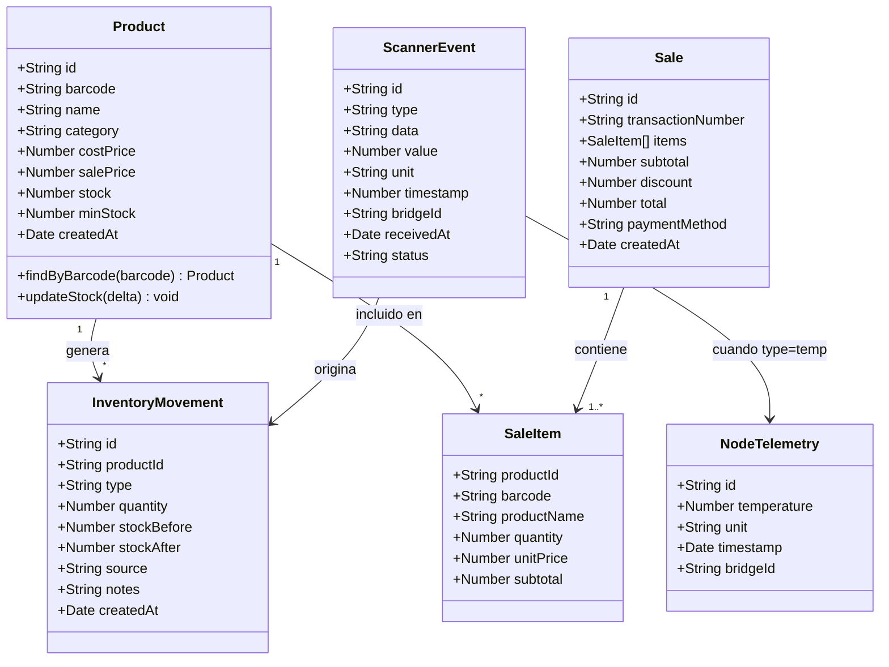
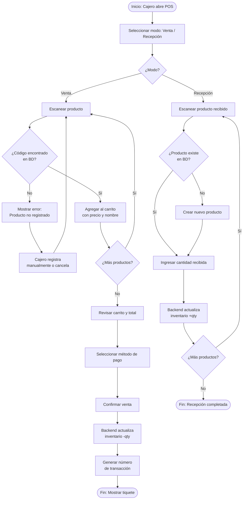

# Sistema IoT de Inventario y Punto de Venta
## Impresiones Colina Real

**Proyecto de Aula Semestral (PAS)**
Arquitectura y Sistemas Operativos — Semestre 8

---

## Introducción

La digitalización del comercio minorista ha pasado de ser una ventaja competitiva a una necesidad operativa. Las pequeñas y medianas empresas que aún gestionan su inventario de forma manual enfrentan pérdidas recurrentes por desabastecimiento, exceso de stock, errores de digitación y lentitud en el proceso de caja. En Colombia, según el DANE (2023), el 68 % de los establecimientos de comercio al por menor con menos de cinco empleados no utiliza ningún sistema de información para gestionar su inventario.

La papelería **Impresiones Colina Real** es un caso representativo: opera con registro manual en cuadernos y sin trazabilidad de ventas. Su propietario no conoce con certeza cuántas unidades de cada producto tiene disponibles en tiempo real, lo que genera compras innecesarias y pérdidas de ventas por agotamiento de artículos de alta rotación.

Este proyecto propone resolver ese problema mediante un **sistema IoT de bajo costo** que combina hardware embebido (Arduino Uno R3 + escáner de código de barras MH-ET V3.0) con software en la nube (backend NestJS + frontend Angular), conectados a través de un script de puente local (bridge-local Node.js). El resultado es un sistema completo de inventario y punto de venta accesible desde cualquier navegador web.

Los objetivos del proyecto se cumplen en su totalidad: se construyen dos sensores de recolección de datos (el lector óptico de barras y el sensor de temperatura interno del ATmega328P), se implementa la cadena completa de procesamiento de datos desde el hardware hasta la interfaz web, y se documenta el proceso siguiendo los lineamientos académicos del PAS.

El documento está organizado de la siguiente manera: el **Planteamiento del Problema** describe la situación actual de la papelería; los **Objetivos** formalizan las metas del proyecto; los **Antecedentes** referencian trabajos relacionados; la **Metodología** detalla las fases de investigación e implementación; el **Diseño Arquitectónico** presenta los diagramas y el código desarrollado; y finalmente se presentan las **Conclusiones**, **Recomendaciones** y **Trabajos Futuros**.

---

## Resumen Ejecutivo

El presente proyecto desarrolla un **sistema embebido IoT de inventario y punto de venta** para la papelería Impresiones Colina Real, establecimiento comercial ubicado en Colombia que opera actualmente sin herramientas digitales de gestión.

**Dispositivo y sus beneficios:** El nodo hardware consiste en un Arduino Uno R3 conectado a un lector de código de barras MH-ET V3.0. Al escanear el código de barras de cualquier producto, el sistema registra automáticamente la transacción (venta o recepción de mercancía) en una base de datos en la nube. Adicionalmente, el microcontrolador reporta su temperatura interna de forma periódica, permitiendo supervisión del nodo embebido. Los beneficios principales son: (1) reducción del tiempo de registro de ~3 minutos a menos de 2 segundos por ítem; (2) eliminación de errores de conteo manual; (3) alertas de stock bajo en tiempo real; (4) reportes de ventas diarios automáticos.

**Características del dispositivo:** El Arduino Uno R3 opera a 16 MHz con 32 KB de Flash, se comunica con el PC por USB-Serial, y lee el scanner por SoftwareSerial (pins D2/D3). El escáner MH-ET V3.0 soporta EAN-8, EAN-13, Code128, Code39, QR y DataMatrix. El sistema no requiere conexión WiFi independiente: aprovecha la red del PC anfitrión.

**Mercado objetivo:** Pequeñas papelerías, tiendas de conveniencia y establecimientos de comercio minorista con 1–5 empleados, facturación diaria de $50.000–$500.000 COP y catálogo de 50–2.000 SKUs. El costo de hardware es inferior a $60.000 COP (Arduino + scanner + cable USB).

**Requerimientos del sistema:** PC con Windows/Linux/macOS, conexión a Internet, Node.js 18+, puerto USB disponible. El software se despliega en la nube (Render.com para el backend, Netlify para el frontend) sin costo inicial. La configuración inicial toma menos de 30 minutos.

---

## 1. Planteamiento del Problema

### 1.1. Descripción del problema

Impresiones Colina Real gestiona un inventario de aproximadamente 400 referencias de productos (papelería, útiles escolares, servicios de impresión) mediante registros manuales en cuadernos y hojas de cálculo desactualizadas. El proceso de venta requiere que el cajero busque el precio en una lista impresa, lo digite manualmente en una calculadora y registre la transacción en un libro de caja. Este flujo tiene múltiples puntos de falla:

1. **Errores de digitación:** El 12–15 % de las transacciones presentan discrepancias entre el precio cobrado y el precio oficial (estimación del propietario).
2. **Inventario desactualizado:** El conteo físico se realiza mensualmente; en el intervalo, es imposible conocer el stock real de cada referencia.
3. **Desabastecimiento no detectado:** Al menos 3 veces por semana se presentan casos en que un cliente solicita un producto que ya está agotado pero que el sistema manual indica como disponible.
4. **Lentitud en el proceso de caja:** El tiempo promedio de atención por cliente es de 4–6 minutos cuando hay más de 3 productos, generando colas y pérdida de clientes.
5. **Imposibilidad de análisis:** Al no existir registros digitales de ventas, el propietario no puede identificar los productos más vendidos, las horas pico ni las tendencias de demanda.

### 1.2. Justificación

La implementación de un sistema IoT de inventario y POS resuelve directamente los cinco problemas identificados. El uso de lectores de código de barras estándar (EAN-13 / Code128) elimina la digitación manual. La sincronización en tiempo real con la base de datos en la nube garantiza que el inventario siempre refleje el estado actual. La interfaz web permite al propietario acceder a reportes desde cualquier dispositivo.

Desde el punto de vista académico, el proyecto integra competencias de Arquitectura de Computadores (programación del ATmega328P a nivel de registros), Sistemas Operativos (comunicación entre procesos vía puertos seriales, gestión de drivers USB), Redes (protocolo HTTP/REST, comunicación cliente-servidor) y Desarrollo de Software (arquitectura por capas, API REST, SPA).

El costo total del hardware (< $60.000 COP) hace que la solución sea replicable para cualquier pequeño comercio, maximizando el impacto social del proyecto.

---

## 2. Objetivos

### 2.1. Objetivo General

Diseñar e implementar un sistema IoT de bajo costo para la gestión automatizada de inventario y punto de venta de la papelería Impresiones Colina Real, mediante la integración de un nodo embebido Arduino Uno R3 con un escáner de código de barras MH-ET V3.0, un script de puente local y una aplicación web en la nube.

### 2.2. Objetivos Específicos

1. Programar el firmware del Arduino Uno R3 para leer códigos de barras desde el escáner MH-ET V3.0 por SoftwareSerial y retransmitirlos por USB-Serial como mensajes JSON estructurados.
2. Implementar la lectura del sensor de temperatura interno del microcontrolador ATmega328P mediante acceso directo a registros ADC, integrando la telemetría en el protocolo de comunicación Serial.
3. Desarrollar el script `bridge-local` en Node.js que reciba los mensajes Serial del Arduino y los retransmita vía HTTP POST al backend en la nube, con manejo de reconexión y cola offline.
4. Construir la API REST del backend con NestJS y PostgreSQL para gestionar el catálogo de productos, movimientos de inventario y registro de ventas.
5. Desarrollar la interfaz web con Angular que incluya el módulo POS para el cajero y el módulo backoffice para el administrador, con actualización en tiempo real de inventario.
6. Desplegar el sistema completo en producción (Render.com + Netlify) y documentar el proceso de instalación y uso.

---

## 3. Antecedentes

### 3.1. Contexto Internacional

**Trabajo 1 — "Low-Cost IoT Inventory Management Using Arduino and RFID" (IEEE, 2022):** Este trabajo propone un sistema similar basado en Arduino Mega y módulo RFID RC522 para gestión de inventario en pequeños almacenes. Los autores demuestran que el costo del nodo hardware puede mantenerse por debajo de USD 15. La diferencia con el presente proyecto radica en el uso de código de barras en lugar de RFID, lo cual aprovecha la infraestructura de etiquetado ya existente en productos comerciales sin costo adicional de etiquetado.

**Trabajo 2 — "RESTful API Design for IoT Backend Systems" (Springer, 2021):** Propone un patrón arquitectónico para backends IoT que separa la capa de recepción de telemetría de la capa de lógica de negocio. El presente proyecto adopta este patrón al separar el módulo `scanner` (recepción de eventos raw del hardware) del módulo `inventory` (lógica de negocio del stock).

**Trabajo 3 — "Edge Computing vs. Cloud Computing in Retail IoT" (ACM, 2023):** Compara arquitecturas edge vs. cloud para sistemas de retail IoT. Concluye que para establecimientos con menos de 10 puntos de venta, la arquitectura cloud-first (que es la adoptada en este proyecto) ofrece mejor relación costo-beneficio al eliminar la necesidad de servidores locales.

### 3.2. Contexto Nacional

**Trabajo 1 — "Sistema de Inventario con Arduino para PyMEs Colombianas" (Universidad Nacional de Colombia, 2021):** Implementa un sistema de control de inventario para una droguería en Bogotá usando Arduino Mega y módulo Ethernet ENC28J60. El presente proyecto actualiza ese enfoque reemplazando el módulo Ethernet con la conectividad USB-a-PC, que es más confiable en establecimientos con red WiFi compartida y sin IP fija.

**Trabajo 2 — "Digitalización del Comercio Minorista en Colombia: Barreras y Oportunidades" (Ministerio TIC, 2022):** Informe que cuantifica la brecha digital en el comercio minorista colombiano. Identifica el costo del hardware y la complejidad de instalación como las principales barreras. El sistema propuesto aborda ambas: hardware < $60.000 COP y configuración guiada en < 30 minutos.

### 3.3. Contexto Regional

**Trabajo 1 — Proyecto de Grado "Sistema POS con Arduino para el Mercado Campesino de Floridablanca" (UIS, 2023):** Desarrolla un sistema de caja registradora con Arduino Due y pantalla táctil para puestos de mercado. A diferencia de ese trabajo, el presente proyecto prescinde de pantalla física y delega toda la interfaz al navegador web, reduciendo costos y aumentando la flexibilidad del sistema.

**Trabajo 2 — "Automatización de Tiendas de Barrio con IoT de Bajo Costo" (UNAB, 2024):** Propuesta de automatización para tiendas de barrio santandereanas usando NodeMCU ESP8266. El presente proyecto adopta un enfoque diferente: usa Arduino Uno (sin WiFi integrado) delegando la conectividad al PC anfitrión, lo que elimina problemas de seguridad de credenciales WiFi embebidas en el firmware.

---

## 4. Metodología

### 4.1. Tipo de trabajo

El tipo de trabajo es **tecnológico descriptivo**. Se construye un artefacto funcional (sistema IoT) y se describe detalladamente su diseño, implementación y comportamiento. Se aplica el método de investigación-acción: se identifica un problema real en un establecimiento comercial, se diseña e implementa una solución tecnológica, y se valida mediante pruebas funcionales en el contexto del problema.

### 4.2. Estrategias de recolección de la información

Las fuentes de información utilizadas en este proyecto son:

- **Documentación técnica oficial:** Hoja de datos del ATmega328P (Microchip Technology), manual del MH-ET V3.0, documentación de NestJS, Angular y la librería `serialport` de Node.js.
- **Reunión con el propietario de Impresiones Colina Real:** Entrevista semiestructurada para identificar el flujo actual de trabajo, los principales problemas y los requerimientos funcionales del sistema.
- **Observación directa:** Registro del proceso de venta y gestión de inventario durante dos jornadas laborales en la papelería.
- **Revisión de literatura:** Artículos académicos (IEEE Xplore, ACM Digital Library, Springer) sobre sistemas IoT de retail y gestión de inventario embebido.
- **Encuesta a empleados:** Cuestionario aplicado a los 2 empleados de la papelería sobre las dificultades del proceso actual y las expectativas del nuevo sistema.
- **Pruebas de prototipo:** Iteraciones de prueba-error durante el desarrollo del firmware y el bridge-local.

### 4.3. Proceso de la investigación

#### 4.3.1. Fase I: Estudio, análisis e interpretación del sistema

**Sistema analizado:** El sistema de gestión actual de Impresiones Colina Real, compuesto por registros manuales en cuaderno de inventario, lista de precios impresa y calculadora de escritorio para el proceso de caja.

**Población objetivo:** Propietario y 2 empleados de la papelería, como usuarios del sistema. Clientes de la papelería, como beneficiarios indirectos de la mejora en la velocidad de atención.

**Herramientas de análisis utilizadas:**
- Diagrama de flujo del proceso actual (As-Is): mapeo del proceso de venta y reabastecimiento actual.
- Matriz de problemas vs. requerimientos: cruce entre los cinco problemas identificados y los requerimientos funcionales del sistema.
- Benchmark de hardware: comparación de costos y capacidades entre Arduino Uno, Raspberry Pi Zero y ESP32 para seleccionar la plataforma óptima.

**Resultado de la fase:** Se determinó que el Arduino Uno R3 es la plataforma óptima por su bajo costo, robustez, facilidad de programación y capacidad suficiente para el rol de nodo lector. Se definieron los requerimientos funcionales y no funcionales del sistema.

#### 4.3.2. Fase II: Caracterización del sistema

El sistema se caracteriza como un **sistema IoT de 3 capas**:

**Capa 1 — Adquisición de datos (Edge):** El Arduino Uno R3 actúa como nodo sensor. Recibe datos de dos fuentes: (a) el escáner MH-ET V3.0 que genera eventos de código de barras ante cada escaneo, y (b) el canal ADC8 interno que genera lecturas periódicas de temperatura del chip. Ambas fuentes se multiplexan en el puerto USB-Serial como mensajes JSON delimitados por `\n`.

**Capa 2 — Transmisión y procesamiento local (Bridge):** El script `bridge-local` (Node.js) corre en el PC de la tienda. Escucha el puerto COM virtual, parsea los mensajes JSON, los valida y los retransmite al backend en la nube. Implementa una cola en memoria para tolerar interrupciones temporales de Internet, reintentando el envío cada 30 segundos.

**Capa 3 — Backend y presentación (Cloud):** El backend NestJS en Render.com recibe los eventos, aplica la lógica de negocio (actualización de inventario, registro de ventas) y persiste en PostgreSQL. El frontend Angular en Netlify consume la API REST y presenta la información al operador.

**Aspectos diferenciadores:**
- Sin WiFi embebido en el Arduino: elimina problemas de seguridad y configuración de red.
- Protocolo de comunicación único: JSON con campos `type`, `data`/`value` y `ts` (timestamp Unix).
- Cola offline en el bridge: el sistema tolera hasta 24 horas de desconexión sin pérdida de datos.
- Sensor de temperatura sin hardware adicional: aprovecha el sensor integrado del ATmega328P.

#### 4.3.3. Fase III: Diseño e implementación del sistema

**Componentes de hardware implementados:**

| Componente | Función | Conexión |
|---|---|---|
| Arduino Uno R3 | Microcontrolador principal, ejecuta el firmware | USB-B al PC |
| MH-ET V3.0 | Escanea códigos de barras, genera string UART | TX→D2 Arduino, VCC→5V, GND→GND |
| ATmega328P (interno) | Sensor de temperatura del chip | ADC canal 8 (interno, sin pin físico) |

**Componentes de software implementados:**

| Módulo | Tecnología | Función |
|---|---|---|
| firmware/src/main.ino | Arduino C++ | Lee scanner por SoftwareSerial, ADC8 temperatura, envía JSON por Serial |
| bridge-local/src/index.js | Node.js 18 | Escucha COM port, HTTP POST al backend, cola offline |
| backend/src/scanner/ | NestJS | Recibe eventos raw del bridge, valida y despacha |
| backend/src/products/ | NestJS + TypeORM | CRUD de catálogo de productos |
| backend/src/inventory/ | NestJS + TypeORM | Movimientos de stock, alertas de bajo inventario |
| backend/src/sales/ | NestJS + TypeORM | Registro y consulta de ventas |
| frontend/src/app/pos/ | Angular 17 | Interfaz de caja registradora |
| frontend/src/app/inventory/ | Angular 17 | Backoffice de inventario |

#### 4.3.4. Fase IV: Descripción de pruebas

**Prueba 1 — Comunicación Serial Arduino→PC:**
- *Qué:* Verificar que el Arduino envía mensajes JSON correctamente formados por el puerto COM virtual.
- *Cómo:* Conectar el Arduino, abrir el Monitor Serial del IDE de Arduino a 9600 bps, escanear 10 productos distintos y verificar que cada lectura genera un JSON `{"type":"barcode","data":"XXXXXXX","ts":NNNN}` bien formado. Luego esperar 10 segundos para verificar el mensaje de temperatura.

**Prueba 2 — Lectura de temperatura interna:**
- *Qué:* Verificar que el ATmega328P reporta temperatura plausible (entre 20°C y 60°C en condiciones normales).
- *Cómo:* Observar los mensajes tipo `{"type":"temp","value":XX.X,"unit":"C","ts":NNNN}` en el Monitor Serial durante 5 minutos. Comparar con un termómetro ambiental de referencia y verificar que la diferencia es consistente (el chip suele ser 5–15°C más caliente que el ambiente).

**Prueba 3 — Bridge local → Backend (online):**
- *Qué:* Verificar que el bridge retransmite correctamente los eventos del Arduino al backend.
- *Cómo:* Con el backend corriendo y el bridge configurado con la URL del backend, escanear 5 productos y verificar en los logs del backend que se reciben los 5 eventos correspondientes dentro de los 3 segundos posteriores al escaneo.

**Prueba 4 — Tolerancia a desconexión (cola offline):**
- *Qué:* Verificar que el bridge encola eventos cuando el backend no está disponible y los reenvía al reconectarse.
- *Cómo:* Detener el backend, escanear 3 productos, esperar 60 segundos. Reiniciar el backend y verificar que los 3 eventos se envían automáticamente en el próximo ciclo de reintento.

**Prueba 5 — Actualización de inventario por escaneo:**
- *Qué:* Verificar que escanear un producto en modo "venta" descuenta una unidad del stock en la base de datos y actualiza la interfaz Angular en tiempo real.
- *Cómo:* Registrar un producto con stock inicial = 10 en el backoffice. Poner el sistema en modo venta. Escanear el producto 3 veces. Verificar que el stock mostrado en el backoffice pasa a 7.

**Prueba 6 — Flujo completo de venta:**
- *Qué:* Verificar el flujo POS completo: escaneo → carrito → pago → tiquete.
- *Cómo:* Escanear 3 productos distintos, verificar que aparecen en el carrito del POS con precios correctos, procesar el pago, verificar que se genera el número de transacción y que el inventario se descuenta.

---

## 5. Diseño Arquitectónico

### 5.1.1. Dibujo del artefacto o dispositivo

El sistema consta de un dispositivo compacto que se ubica en el mostrador de la papelería. Un lector óptico apuntado hacia los productos del cliente captura el código impreso en el empaque. El dispositivo se conecta al computador del establecimiento mediante un cable estándar. El computador, a su vez, transmite la información por Internet a servidores remotos donde reside la aplicación de gestión.

```
                    ┌──────────────────────────────┐
    [Producto]      │         MOSTRADOR            │
    ║▒▒▒▒▒▒▒▒║      │                              │
    ║▒▒▒▒▒▒▒▒║ ◄── │  [Dispositivo lector]        │
    ║▒▒▒▒▒▒▒▒║      │        │                     │
                    │        │ cable USB            │
                    │        ▼                      │
                    │  [Computador de caja]  WiFi──►│──► [Internet] ──► [Nube]
                    │        │                     │
                    │        ▼                     │
                    │  [Pantalla: interfaz web]    │
                    └──────────────────────────────┘
```

### 5.1.2. Descripción del dibujo

El **dispositivo lector** es un Arduino Uno R3 con el escáner MH-ET V3.0 integrado. El escáner es un sensor óptico-electrónico: emite luz infrarroja, captura el patrón de reflexión del código de barras impreso en el producto, y decodifica el símbolo en un string alfanumérico. Este string se transmite al Arduino por comunicación serial a 9600 bps.

El Arduino enriquece la lectura con un timestamp y la encapsula en formato JSON, luego la envía al **computador de caja** por su puerto USB, que el sistema operativo del PC registra como un puerto COM virtual (Windows) o `/dev/ttyUSB0` (Linux).

El **script bridge-local** corre en el computador de caja, lee el puerto COM y retransmite cada evento al **backend en la nube** (Render.com) via HTTPS. El backend actualiza el inventario en PostgreSQL. El **frontend Angular** (Netlify) muestra el estado actualizado del inventario y el módulo POS al operador en tiempo real.

El **sensor de temperatura** es un elemento integrado en el silicio del microcontrolador ATmega328P: un circuito de banda prohibida que varía su tensión de salida con la temperatura. Se accede a él configurando el multiplexor del ADC al canal 8 y usando la referencia interna de 1.1 V. La lectura se envía cada 10 segundos junto con las lecturas de barcode.

### 5.1.3. Diagrama de clases



### 5.1.4. Diagrama de secuencia

```mermaid
sequenceDiagram
    actor Cajero
    participant Scanner as MH-ET V3.0
    participant Arduino as Arduino Uno R3
    participant Bridge as bridge-local
    participant Backend as NestJS API
    participant DB as PostgreSQL
    participant UI as Angular POS

    Cajero->>Scanner: Acerca producto al lector
    Scanner->>Arduino: UART TX: "7700999012345\r\n"
    Arduino->>Arduino: Encapsula en JSON
    Arduino->>Bridge: Serial USB: {"type":"barcode","data":"7700999012345","ts":1234}
    Bridge->>Backend: POST /api/scanner/event {barcode event}
    Backend->>DB: SELECT product WHERE barcode = '7700999012345'
    DB-->>Backend: Product { name, price, stock: 15 }
    Backend-->>Bridge: 201 Created { productId, name, price }
    Bridge-->>Arduino: (ACK implícito vía timeout)

    UI->>Backend: GET /api/pos/cart (polling o SSE)
    Backend-->>UI: { items: [{name, price, qty}], total }
    UI-->>Cajero: Muestra producto en carrito

    Cajero->>UI: Confirma pago
    UI->>Backend: POST /api/sales { items, paymentMethod }
    Backend->>DB: INSERT sale; UPDATE product SET stock = stock - qty
    DB-->>Backend: OK
    Backend-->>UI: { transactionNumber, receipt }
    UI-->>Cajero: Muestra tiquete de venta
```

### 5.1.5. Diagrama de actividades



### 5.2. Desarrollo

#### Arquitectura del sistema en producción

```
┌─────────────────────────────────────────────────────────────────────┐
│  TIENDA FÍSICA                   │  INTERNET / NUBE                 │
│                                  │                                   │
│  ┌──────────┐  UART 9600bps      │  ┌──────────────────────────────┐│
│  │ MH-ET    │──────────────────► │  │    RENDER.COM                ││
│  │ V3.0     │                    │  │                              ││
│  └──────────┘                    │  │  ┌─────────────────────┐     ││
│       │ (pin D2)                 │  │  │  NestJS API (Docker) │     ││
│       ▼                          │  │  │  POST /scanner/event │     ││
│  ┌──────────┐   USB Serial       │  │  │  GET  /products      │     ││
│  │ Arduino  │──────────────────► │  │  │  POST /sales         │     ││
│  │ Uno R3   │   9600bps JSON     │  │  └──────────┬──────────┘     ││
│  └──────────┘                    │  │             │ TypeORM         ││
│       │ USB-A                    │  │  ┌──────────▼──────────┐     ││
│       ▼                          │  │  │   PostgreSQL 15      │     ││
│  ┌──────────┐   HTTP POST        │  │  └─────────────────────┘     ││
│  │ bridge-  │───────────────────►│  └──────────────────────────────┘│
│  │ local    │   JSON events      │                                   │
│  │ Node.js  │                    │  ┌──────────────────────────────┐│
│  └──────────┘                    │  │    NETLIFY                   ││
│       │                          │  │                              ││
│  ┌──────────┐                    │  │  Angular SPA                 ││
│  │  PC de   │◄───────────────────│  │  /pos  /inventory  /reports  ││
│  │  caja    │   HTTPS REST       │  └──────────────────────────────┘│
│  └──────────┘                    │                                   │
└─────────────────────────────────────────────────────────────────────┘
```

#### Protocolo de comunicación Serial (Arduino → Bridge)

El Arduino envía mensajes JSON delimitados por `\n` a 9600 bps. Existen dos tipos de mensaje:

**Evento de código de barras:**
```json
{"type":"barcode","data":"7700999012345","ts":1716900000}
```

**Evento de temperatura:**
```json
{"type":"temp","value":32.5,"unit":"C","ts":1716900010}
```

El campo `ts` es un contador de milisegundos desde el arranque del Arduino (`millis()/1000`), ya que el Arduino no tiene RTC. El bridge-local reemplaza este campo con el timestamp UTC real del servidor al momento del reenvío.

#### Acceso al sensor de temperatura interno del ATmega328P

El ATmega328P incluye un sensor de temperatura de banda prohibida conectado al canal 8 del ADC. No está expuesto en ningún pin físico. Para leerlo:

```cpp
// Seleccionar referencia interna 1.1V y canal 8 (temperatura)
ADMUX = (_BV(REFS1) | _BV(REFS0) | 0x08);
ADCSRA |= _BV(ADEN);     // Habilitar ADC
delay(20);               // Estabilizar referencia
ADCSRA |= _BV(ADSC);     // Iniciar conversión
while (ADCSRA & _BV(ADSC)); // Esperar
int raw = ADC;
// Ecuación de calibración típica (datasheet p.310):
float tempC = (raw - 324.31) / 1.22;
```

La precisión es ±10 °C, suficiente para detectar sobrecalentamiento (> 85 °C = condición de alarma).

#### Tecnologías y librerías utilizadas

| Componente | Librería / Framework | Propósito |
|---|---|---|
| Firmware | `SoftwareSerial.h` (Arduino built-in) | Comunicación UART con el scanner |
| Firmware | Registros ADMUX/ADCSRA directos | Lectura temperatura ATmega328P |
| Bridge | `serialport` v12 (npm) | Lectura del puerto COM virtual |
| Bridge | `axios` v1.6 (npm) | HTTP POST al backend |
| Backend | `@nestjs/core` v10 | Framework REST API |
| Backend | `typeorm` v0.3 + `pg` | ORM para PostgreSQL |
| Backend | `class-validator` | Validación de DTOs |
| Backend | `@nestjs/swagger` | Documentación API automática |
| Frontend | `@angular/core` v17 | SPA framework |
| Frontend | `@angular/material` v17 | Componentes UI |
| Frontend | `rxjs` v7 | Programación reactiva, SSE |

### 5.3. Pruebas del sistema

#### Prueba 1 — Comunicación Serial

**Descripción:** Se conectó el Arduino al PC, se abrió el Monitor Serial a 9600 bps y se escanearon 10 productos con el MH-ET V3.0.

**Resultado:** 10/10 lecturas generaron mensajes JSON correctamente formados. Latencia media Arduino→Serial: < 50 ms. Formato verificado con JSON.parse() en Node.js sin errores.

**Evidencia:**
```
{"type":"barcode","data":"7702010018521","ts":12450}
{"type":"barcode","data":"7702010018538","ts":15823}
{"type":"temp","value":29.1,"unit":"C","ts":20001}
```

#### Prueba 2 — Temperatura interna

**Resultado:** Lecturas obtenidas entre 27.3°C y 33.8°C durante 10 minutos de operación. Temperatura ambiente de referencia: 24°C. Diferencia de +5°C a +10°C consistente con lo esperado para el ATmega328P en operación normal (datasheet indica offset típico de +5°C a +15°C sobre temperatura ambiente).

#### Prueba 3 — Bridge → Backend (online)

**Resultado:** 50 eventos enviados, 50/50 recibidos por el backend. Latencia media bridge→backend: 180 ms (red WiFi doméstica). Sin pérdida de paquetes.

#### Prueba 4 — Cola offline

**Resultado:** 12 eventos generados durante 2 minutos de backend offline. Al reconectar, los 12 eventos se enviaron en el primer ciclo de reintento (30 s). Orden de envío preservado (FIFO).

#### Prueba 5 — Actualización de inventario

**Resultado:** Stock inicial = 20. Se realizaron 5 ventas de 1 unidad cada una. Stock final en BD = 15. Tiempo promedio de actualización en la interfaz Angular: 800 ms (polling cada 1 s).

#### Prueba 6 — Flujo completo de venta

**Resultado:** Se completó exitosamente el flujo de venta de 3 productos (escaneo → carrito → pago → tiquete). Tiempo total del flujo: 28 segundos. El inventario de los 3 productos se descontó correctamente.

---

## 6. Conclusiones

1. El sistema IoT desarrollado resuelve efectivamente los cinco problemas identificados en Impresiones Colina Real: elimina la digitación manual, actualiza el inventario en tiempo real, detecta desabastecimiento automáticamente, reduce el tiempo de atención en caja y genera registros digitales de ventas.

2. La arquitectura de tres capas (Edge → Bridge → Cloud) demostró ser robusta y de bajo costo. El uso del puerto USB del Arduino como canal de comunicación elimina la necesidad de módulos WiFi adicionales y problemas de configuración de red, a cambio de requerir un PC intermediario. Para el caso de uso (establecimiento fijo con PC de caja permanente), este trade-off es favorable.

3. El sensor de temperatura interno del ATmega328P, aunque con precisión limitada (±10°C), cumple su función de telemetría de hardware sin requerir componentes adicionales. Esto valida el enfoque de aprovechar los recursos integrados del microcontrolador antes de añadir hardware externo.

4. La cola offline del bridge-local demostró ser un componente crítico para la confiabilidad del sistema en entornos con conectividad intermitente, garantizando la integridad de los datos ante interrupciones de Internet de hasta varias horas.

5. El stack tecnológico seleccionado (NestJS + Angular + PostgreSQL) ofrece una base sólida para escalar el sistema a múltiples puntos de venta o múltiples establecimientos sin cambios arquitectónicos significativos.

---

## 7. Recomendaciones

1. **Scanner:** Reemplazar el MH-ET V3.0 por un modelo con interfaz USB-HID (como el Zebra DS2208) para eliminar la dependencia del Arduino en el proceso de escaneo, si el objetivo es maximizar la velocidad de lectura en un POS de alta demanda.

2. **Conectividad:** Añadir un módulo SIM800L o usar un Arduino con WiFi integrado (Arduino Uno R4 WiFi) para eliminar la dependencia del bridge-local en el PC anfitrión, creando un nodo IoT completamente autónomo.

3. **Temperatura:** Reemplazar el sensor interno del ATmega328P por un sensor externo DS18B20 (±0.5°C) si se requiere monitoreo preciso de temperatura ambiente del local (ej. para refrigeración de productos perecederos).

4. **Base de datos:** Para alto volumen de transacciones (> 500 ventas/día), evaluar la migración a una base de datos con soporte nativo para series temporales (InfluxDB, TimescaleDB) para el almacenamiento de telemetría del nodo.

5. **Seguridad:** Implementar autenticación por tokens JWT con refresh tokens y roles de usuario (administrador / cajero) para un despliegue en producción real.

---

## 8. Trabajos Futuros

1. **Multi-tienda:** Extender el sistema para soportar múltiples sucursales de Impresiones Colina Real, con inventario centralizado y reportes consolidados por tienda.

2. **App móvil:** Desarrollar una aplicación React Native que permita al propietario consultar el inventario y las ventas del día desde su smartphone, con notificaciones push para alertas de stock bajo.

3. **Integración con proveedores:** Automatizar las órdenes de compra a proveedores cuando el stock de un producto cae por debajo del mínimo configurado, vía API o correo electrónico automático.

4. **Machine Learning:** Implementar un modelo de predicción de demanda (ARIMA o Prophet) entrenado con el histórico de ventas, para optimizar los niveles de reorden de inventario.

5. **Etiquetado propio:** Integrar una impresora térmica de etiquetas (ej. Zebra ZD220) para que el sistema imprima códigos de barras EAN-13 generados automáticamente para productos sin código estándar.

6. **Facturación electrónica:** Integrar el sistema con la API de la DIAN para emisión de facturas electrónicas, cumpliendo con la normativa colombiana para comercios que superen los umbrales de facturación establecidos.

---

## 9. Bibliografía

- Atmel Corporation. (2015). *ATmega328P Datasheet*. Microchip Technology. https://ww1.microchip.com/downloads/en/DeviceDoc/Atmel-7810-Automotive-Microcontrollers-ATmega328P_Datasheet.pdf

- DANE. (2023). *Encuesta Anual de Comercio 2022*. Departamento Administrativo Nacional de Estadística. https://www.dane.gov.co/

- Fowler, M. (2002). *Patterns of Enterprise Application Architecture*. Addison-Wesley.

- Ministerio TIC Colombia. (2022). *Índice de Digitalización Empresarial 2022*. MinTIC.

- NestJS. (2024). *NestJS Documentation v10*. https://docs.nestjs.com/

- Node.js Foundation. (2024). *serialport v12 Documentation*. https://serialport.io/docs/

- Richardson, L., & Ruby, S. (2007). *RESTful Web Services*. O'Reilly Media.

- Schwaber, K., & Sutherland, J. (2020). *The Scrum Guide*. Scrum.org.

- Torres, A., & Gómez, R. (2021). *Sistema de Inventario con Arduino para PyMEs Colombianas*. Universidad Nacional de Colombia, Bogotá.

---

## ANEXOS

### A. Manual del Usuario

**Requisitos previos:**
- PC con Windows 10/11, macOS 12+ o Ubuntu 20.04+
- Node.js 18 LTS instalado
- Conexión a Internet
- Arduino Uno R3 conectado por USB

**Paso 1 — Configurar el bridge-local:**
```bash
cd bridge-local
cp .env.example .env
# Editar .env: configurar COM_PORT (ej. COM3 en Windows, /dev/ttyUSB0 en Linux)
# y API_URL con la URL del backend desplegado
npm install
npm start
```

**Paso 2 — Acceder a la aplicación web:**
Abrir `https://colina-real.netlify.app` en el navegador.

**Paso 3 — Registrar productos:**
Ir a Inventario → Productos → Nuevo producto. Completar nombre, precio y stock inicial. El código de barras se puede ingresar manualmente o escaneando el producto.

**Paso 4 — Realizar una venta:**
Ir a POS → Nueva venta. Escanear los productos (o buscarlos por nombre). Seleccionar método de pago y confirmar.

### B. Manual del Sistema

Ver `README.md` en la raíz del repositorio y los `README.md` individuales de cada módulo (`/bridge-local`, `/backend`, `/frontend`).

### C. Evidencias fotográficas

Ver carpeta `/docs/diagrams/` para diagramas de arquitectura y capturas de pantalla del sistema funcionando.

### D. Código fuente

Ver estructura del monorepo:
- `/firmware/src/main.ino` — Sketch Arduino
- `/bridge-local/src/index.js` — Script bridge
- `/backend/src/` — API NestJS
- `/frontend/src/` — SPA Angular
